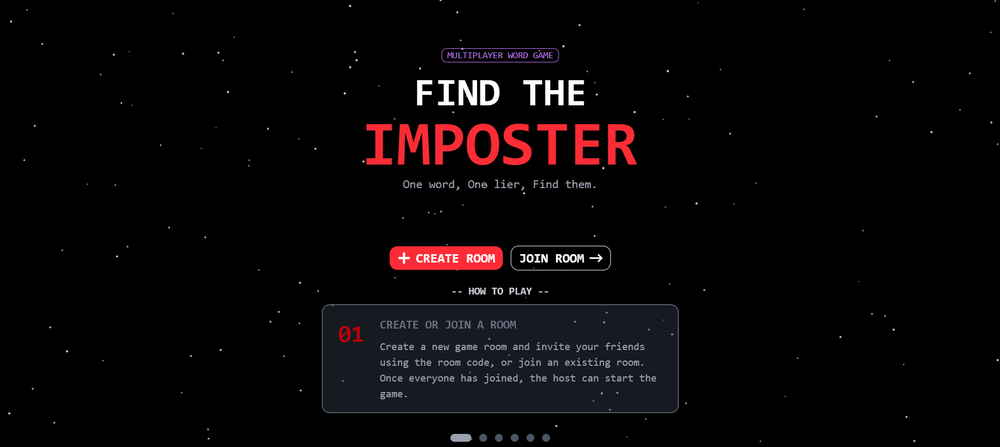
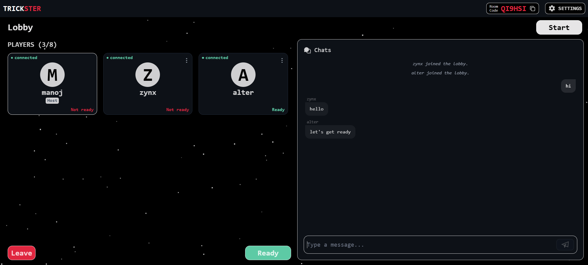
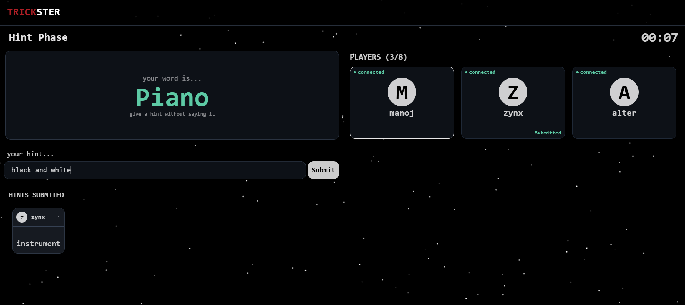
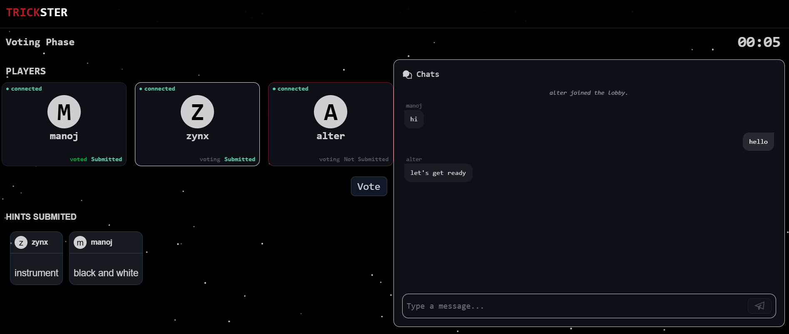
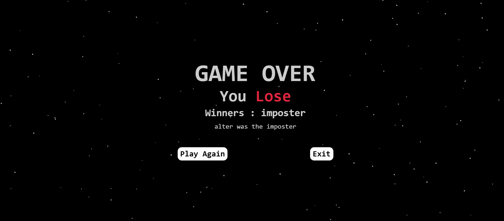

# 🎭 Trickster

> A real-time multiplayer social deduction word game built with **React**, **Node.js**, **Express**, and **Socket.IO**.

Players receive secret words and must identify the Imposter through clever hints and discussion. Every game is synchronized in real time using WebSockets for a smooth multiplayer experience.

---

## ✨ Features

- 🎮 Real-time multiplayer gameplay
- 🌐 Socket.IO powered communication
- 🏠 Create and join private game rooms
- 👑 Host-controlled lobby
- ⚙️ Configurable game settings
- 📝 Hint submission phase
- 🗳️ Live voting system
- 💬 In-game chat
- ⏱️ Countdown timers
- 🔄 Automatic game state synchronization
- 📱 Responsive UI
- ✨ Smooth animations using Framer Motion

---

## 🖥️ Tech Stack

### Frontend

- React 19
- Vite
- Tailwind CSS
- Framer Motion
- Socket.IO Client
- Axios

### Backend

- Node.js
- Express.js
- Socket.IO
- Nodemon

---

## 📁 Project Structure

```
Trickster
│
├── client
│   ├── public
│   └── src
│       ├── actions
│       ├── AnimatedContainer
│       ├── components
│       ├── hooks
│       ├── pages
│       ├── sockets
│       └── utils
│
├── server
│   └── src
│       ├── managers
│       ├── middleware
│       ├── models
│       ├── services
│       ├── sockets
│       ├── store
│       └── utils
│
└── README.md
```

---

## 🎮 Game Flow

```text
Create / Join Room
        │
        ▼
      Lobby
        │
        ▼
   Host Starts Game
        │
        ▼
 Secret Word Assigned
        │
        ▼
    Hint Phase
        │
        ▼
    Voting Phase
        │
        ▼
    Round Result
        │
        ▼
 Next Round / Game End
```

---

## 🚀 Getting Started

### Clone the repository

```bash
git clone https://github.com/Manoj72-dev/Trickster.git
cd Trickster
```

---

## Install Dependencies

### Client

```bash
cd client
npm install
```

### Server

```bash
cd server
npm install
```

---

## Run the Project

### Start the backend

```bash
cd server
npm run dev
```

### Start the frontend

```bash
cd client
npm run dev
```

The application will be available at:

```
Frontend : http://localhost:portno
Backend  : http://localhost:portno
```

---

## ⚙️ Environment Variables

Create a `.env` file inside the **server** directory.

```env
PORT= port_number
CLIENT_URL= your_backend_ulr_something_like_localHost//Portno
```

---

## 🎲 Gameplay

1. Create or join a room.
2. Wait for all players.
3. Host starts the game.
4. Every player receives a secret word.
5. One player becomes the **Imposter**.
6. Players submit hints one by one.
7. Everyone votes for the suspected Imposter.
8. Scores are calculated and the next round begins.

---

## 🏗️ Backend Architecture

The backend follows a modular architecture.

```
Socket Events
      │
      ▼
Managers
      │
      ▼
Services
      │
      ▼
Models / Store
```

### Managers

Handle game flow and coordinate business logic.

### Services

Contain reusable game logic.

### Models

Represent Room and Player objects.

### Store

Maintain in-memory game rooms and word lists.

### Socket Layer

Handles all real-time communication between clients and server.

---

## 📡 Real-Time Events

### Client → Server

- room:create
- room:join
- room:leave
- game:start
- hint:submit
- vote:submit
- chat:send

### Server → Client

- room:created
- room:updated
- your:word
- phase:changed
- vote:result
- game:ended
- player:kicked

---
## 🚀 Live Demo
- Frontend: https://trickster-seven.vercel.app/
- Backend/API: https://trickster-nrdx.onrender.com
## 📸 Screenshots

Add screenshots of:

- Home Page

- Lobby

- Hint Phase

- Voting Phase

- Result Screen


# note:- screens UI will be changed later with respect to new features.
---

## 🚀 Future Improvements

- Voice Chat
- Public Matchmaking
- Reconnect Support
- Leaderboards
- Player Statistics
- Match History
- Spectator Mode
- Custom Word Packs
- Mobile App

---

## 🤝 Contributing

Contributions are welcome.

1. Fork the repository.
2. Create a new branch.

```bash
git checkout -b feature/my-feature
```

3. Commit your changes.

```bash
git commit -m "Add my feature"
```

4. Push the branch.

```bash
git push origin feature/my-feature
```

5. Open a Pull Request.

---


## 👨‍💻 Author

**Manoj Chauhan**

GitHub: https://github.com/Manoj72-dev

---

⭐ If you like this project, consider giving it a star!